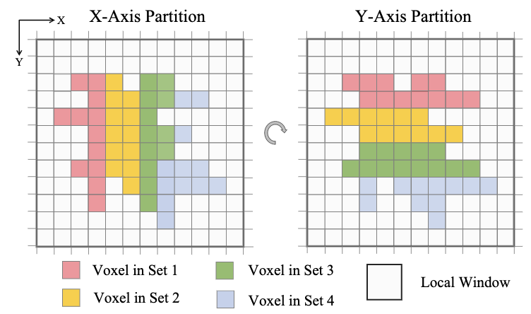
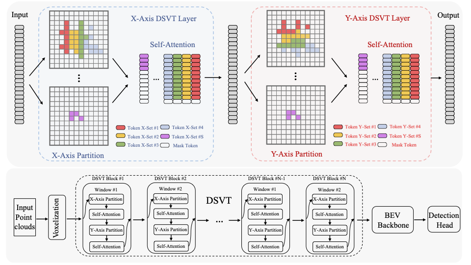
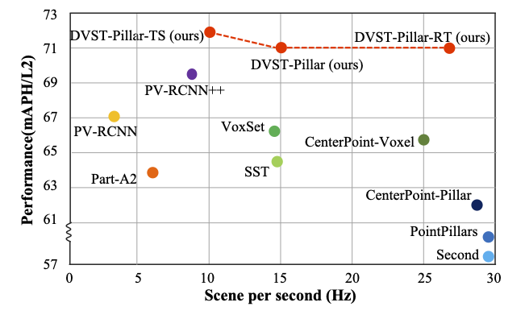
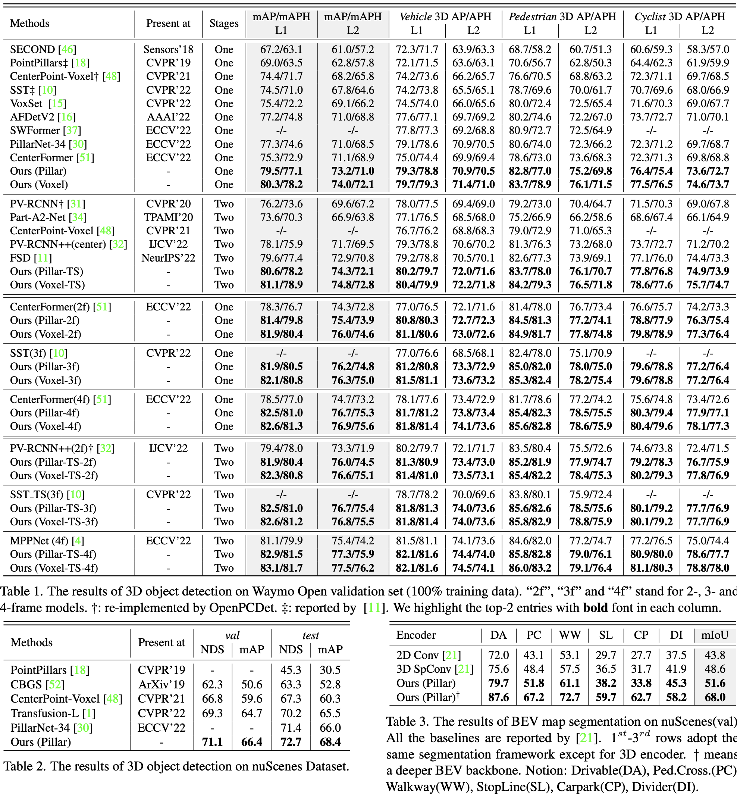
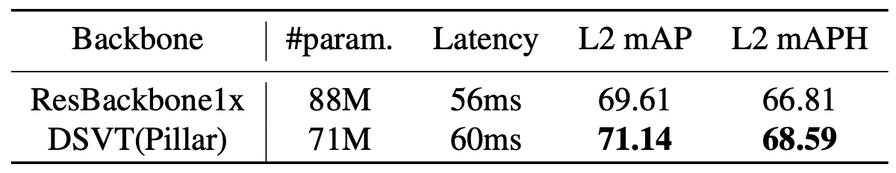

[](https://paperswithcode.com/sota/3d-object-detection-on-waymo-vehicle?p=dsvt-dynamic-sparse-voxel-transformer-with)
[](https://paperswithcode.com/sota/3d-object-detection-on-waymo-pedestrian?p=dsvt-dynamic-sparse-voxel-transformer-with)
[](https://paperswithcode.com/sota/3d-object-detection-on-waymo-cyclist?p=dsvt-dynamic-sparse-voxel-transformer-with)
[](https://paperswithcode.com/sota/3d-object-detection-on-nuscenes-lidar-only?p=dsvt-dynamic-sparse-voxel-transformer-with)

[](https://openaccess.thecvf.com/content/CVPR2023/html/Wang_DSVT_Dynamic_Sparse_Voxel_Transformer_With_Rotated_Sets_CVPR_2023_paper.html) [](https://arxiv.org/abs/2301.06051) [](https://github.com/Haiyang-W/DSVT) 

# DSVT: an efficient and deployment-friendly sparse backbone for large-scale point clouds
	
<!-- [](https://paperswithcode.com/sota/3d-object-detection-on-waymo-pedestrian?p=embracing-single-stride-3d-object-detector)
[](https://paperswithcode.com/sota/3d-object-detection-on-waymo-cyclist?p=embracing-single-stride-3d-object-detector)
[](https://paperswithcode.com/sota/3d-object-detection-on-waymo-vehicle?p=embracing-single-stride-3d-object-detector) -->

This repo is the official implementation of CVPR paper: [DSVT: Dynamic Sparse Voxel Transformer with Rotated Sets](https://openaccess.thecvf.com/content/CVPR2023/papers/Wang_DSVT_Dynamic_Sparse_Voxel_Transformer_With_Rotated_Sets_CVPR_2023_paper.pdf) as well as the follow-ups. Our DSVT achieves state-of-the-art performance on large-scale Waymo Open Dataset with real-time inference speed (27Hz). We have made every effort to ensure that the codebase is clean, concise, easily readable, state-of-the-art, and relies only on minimal dependencies.

> DSVT: Dynamic Sparse Voxel Transformer with Rotated Sets
>
> [Haiyang Wang*](https://scholar.google.com/citations?user=R3Av3IkAAAAJ&hl=en&oi=ao), Chen Shi*, Shaoshuai Shi $^\dagger$, Meng Lei, Sen Wang, Di He, Bernt Schiele, Liwei Wang $^\dagger$
> - Primary contact: Haiyang Wang ( wanghaiyang6@stu.pku.edu.cn )

<div align="center">
  
</div>

## News
- [23-08-22] Thank [jingyue202205](https://github.com/jingyue202205) for his diligent efforts. DSVT is implemented using the TensorRT in an end-to-end manner, referring to [here](https://github.com/jingyue202205/DSVT-AI-TRT). 
- [23-08-15] Bug Alert: We use incorrect position embeddings in DSVTBlock (see [issue#50](https://github.com/Haiyang-W/DSVT/issues/50)). 
- [23-07-09] Bugfixed: The bug of wrong dynamic shape used in trtexec has been fixed (see [issue#43](https://github.com/Haiyang-W/DSVT/issues/43) and [deploy guidance](https://github.com/Haiyang-W/DSVT#tensorrt-deployment)). Before: Pytorch(`36.0ms`) -> TRT-fp16(`32.9ms`), After: Pytorch(`36.0ms`) -> TRT-fp16(`13.8ms`) 
- [23-06-30] 🔥 DSVT (Waymo) has been merged to [OpenPCDet](https://github.com/open-mmlab/OpenPCDet/blob/master/tools/cfgs/waymo_models/dsvt_pillar.yaml).
- [23-06-23] 🔥 Code of Deployment is released.
- [23-06-03] Code of NuScenes is released (SOTA).
- [23-03-30] Code of Waymo is released (SOTA).
- [23-02-28] 🔥 DSVT is accepted at [CVPR 2023](https://openaccess.thecvf.com/content/CVPR2023/papers/Wang_DSVT_Dynamic_Sparse_Voxel_Transformer_With_Rotated_Sets_CVPR_2023_paper.pdf).
- [23-01-15] DSVT is released on [arXiv](https://arxiv.org/abs/2301.06051).

## Overview
- [Todo](https://github.com/Haiyang-W/DSVT#todo)
- [Introduction](https://github.com/Haiyang-W/DSVT#introduction)
- [Main Results](https://github.com/Haiyang-W/DSVT#main-results)
- [Installation](https://github.com/Haiyang-W/DSVT#installation)
- [Quick Start](https://github.com/Haiyang-W/DSVT#quick-start)
- [TensorRT Deployment](https://github.com/Haiyang-W/DSVT#tensorrt-deployment)
- [Possible Issues](https://github.com/Haiyang-W/DSVT#possible-issues)
- [Citation](https://github.com/Haiyang-W/DSVT#citation)
- [Potential Research](https://github.com/Haiyang-W/DSVT#potential-research)

## TODO

- [x] Release the [arXiv](https://arxiv.org/abs/2301.06051) version.
- [x] SOTA performance of 3D object detection (Waymo & Nuscenes) and BEV Map Segmentation (Nuscenes).
- [x] Clean up and release the code of Waymo.
- [x] Release code of NuScenes.
- [x] Release code of Deployment.
- [x] Merge DSVT to [OpenPCDet](https://github.com/open-mmlab/OpenPCDet).
- [ ] Release the Waymo Multi-Frames Configs.

## Introduction
Dynamic Sparse Voxel Transformer is an efficient yet deployment-friendly 3D transformer backbone for outdoor 3D object detection. It partitions a series of local regions in each window according to its sparsity and then computes the features of all regions in a fully parallel manner. Moreover, to allow the cross-set connection, it designs a rotated set partitioning strategy that alternates between two partitioning configurations in consecutive self-attention layers.

DSVT achieves state-of-the-art performance on large-scale Waymo one-sweeps 3D object detection (`78.2 mAPH L1` and `72.1 mAPH L2` on one-stage setting) and (`78.9 mAPH L1` and `72.8 mAPH L2` on two-stage setting), surpassing previous models by a large margin. Moreover, as for multiple sweeps setting ( `2`, `3`, `4` sweeps settings), our model reaches `74.6 mAPH L2`, `75.0 mAPH L2` and `75.6 mAPH L2` in terms of one-stage framework and `75.1 mAPH L2`, `75.5 mAPH L2` and `76.2 mAPH L2` on two-stage framework, which outperforms the previous best multi-frame methods with a large margin. Note that our model is not specifically designed for multi-frame detection, and only takes concatenated point clouds as input.



## Main results
**We provide the pillar and voxel 3D version of one-stage DSVT. The two-stage versions with [CT3D](https://github.com/hlsheng1/CT3D) are also listed below.**
### 3D Object Detection (on Waymo validation)
We run training for 3 times and report average metrics across all results. Regrettably, we are unable to provide the pre-trained model weights due to [Waymo Dataset License Agreement](https://waymo.com/open/terms/). However, we can provide the training logs.
#### One-Sweeps Setting
|  Model  |  #Sweeps | mAP/H_L1 | mAP/H_L2 | Veh_L1 | Veh_L2 | Ped_L1 | Ped_L2 | Cyc_L1 | Cyc_L2 | Log |
|---------|---------|--------|--------|--------|--------|--------|--------|--------|--------|--------|
|  [DSVT(Pillar)](tools/cfgs/dsvt_models/dsvt_plain_1f_onestage.yaml) | 1       |  79.5/77.1  | 73.2/71.0  | 79.3/78.8 | 70.9/70.5 | 82.8/77.0 | 75.2/69.8 | 76.4/75.4 | 73.6/72.7 | [Log](https://drive.google.com/file/d/1DlEMIb-ZUFilJBDd8fuyb8nuRnSFPzWy/view?usp=share_link) |
|  [DSVT(Voxel)](tools/cfgs/dsvt_models/dsvt_3D_1f_onestage.yaml) | 1        |  80.3/78.2  |  74.0/72.1  | 79.7/79.3 | 71.4/71.0 | 83.7/78.9 | 76.1/71.5 | 77.5/76.5 | 74.6/73.7 | [Log](https://drive.google.com/file/d/19Z8Q6Mp945XJaLuccb5rtYejGQdl7xjG/view?usp=share_link) | 
|  DSVT(Pillar-TS) | 1    |  80.6/78.2  |  74.3/72.1  | 80.2/79.7 | 72.0/71.6 | 83.7/78.0 | 76.1/70.7 | 77.8/76.8 | 74.9/73.9 | [Log](https://drive.google.com/file/d/1YeVpF7An79yBZApCkagfnwGgFniZWRZl/view?usp=share_link) | 
|  DSVT(Voxel-TS) | 1     |  81.1/78.9  |  74.8/72.8  | 80.4/79.9 | 72.2/71.8 | 84.2/79.3 | 76.5/71.8 | 78.6/77.6 | 75.7/74.7 | [Log](https://drive.google.com/file/d/1hwrQ2iEiuIBKlXn1UhOGYhwdfogF9PpY/view?usp=share_link) | 

#### Multi-Sweeps Setting
##### 2-Sweeps
|  Model  |  #Sweeps | mAP/H_L1 | mAP/H_L2 | Veh_L1 | Veh_L2 | Ped_L1 | Ped_L2 | Cyc_L1 | Cyc_L2 | Log |
|---------|---------|--------|--------|--------|--------|--------|--------|--------|--------|--------|
|  DSVT(Pillar) | 2        |  81.4/79.8  |  75.4/73.9  | 80.8/80.3 | 72.7/72.3 | 84.5/81.3 | 77.2/74.1 | 78.8/77.9 | 76.3/75.4 | [Log](https://drive.google.com/file/d/13uFqSxxlQuywLvU5CZhK9R7JoGqVXAt4/view?usp=share_link) |
|  DSVT(Voxel) | 2       |  81.9/80.4  |  76.0/74.6  | 81.1/80.6 | 73.0/72.6 | 84.9/81.7 | 77.8/74.8 | 79.8/78.9 | 77.3/76.4 | [Log](https://drive.google.com/file/d/1Ketd-x5MvJXBbJiFAeVtFDQyyACGekL-/view?usp=share_link) |
|  DSVT(Pillar-TS) | 2       |  81.9/80.4  |  76.0/74.5  | 81.3/80.9 | 73.4/73.0 | 85.2/81.9 | 77.9/74.7 | 79.2/78.3 | 76.7/75.9 | [Log](https://drive.google.com/file/d/1tTyg3mkTTuYrbk3O_F2C5R8Yi0JYXfkb/view?usp=share_link) | 
|  DSVT(Voxel-TS) | 2       |  82.3/80.8  |  76.6/75.1  | 81.4/81.0 | 73.5/73.1 | 85.4/82.2 | 78.4/75.3 | 80.2/79.3 | 77.8/76.9 | [Log](https://drive.google.com/file/d/15BH2FwQIZQ3IVkPmexilrVd4BO7shIcK/view?usp=share_link) |

##### 3-Sweeps
|  Model  |  #Sweeps | mAP/H_L1 | mAP/H_L2 | Veh_L1 | Veh_L2 | Ped_L1 | Ped_L2 | Cyc_L1 | Cyc_L2 | Log |
|---------|---------|--------|--------|--------|--------|--------|--------|--------|--------|--------|
|  DSVT(Pillar) | 3       |  81.9/80.5  |  76.2/74.8  | 81.2/80.8 | 73.3/72.9 | 85.0/82.0 | 78.0/75.0 | 79.6/78.8 | 77.2/76.4 | [Log](https://drive.google.com/file/d/1C7Koel3xVVixpkQenJyx7koIMQ2x-pbU/view?usp=share_link) | 
|  DSVT(Voxel) | 3       |  82.1/80.8  |  76.3/75.0  |  81.5/81.1 | 73.6/73.2 | 85.3/82.4 | 78.2/75.4 | 79.6/78.8 | 77.2/76.4 | [Log](https://drive.google.com/file/d/1BOiCTcN8Izz6hY3sQeifTjxSHnMkz-S5/view?usp=share_link) | 
|  DSVT(Pillar-TS) | 3       |  82.5/81.0  |  76.7/75.4  | 81.8/81.3 | 74.0/73.6 | 85.6/82.6 | 78.5/75.6 | 80.1/79.2 | 77.7/76.9 | [Log](https://drive.google.com/file/d/1ylMBirihLJLIVXEllLHxw5C7JQoYXZpL/view?usp=share_link) | 
|  DSVT(Voxel-TS) | 3       |  82.6/81.2  |  76.8/75.5  | 81.8/81.4 | 74.0/73.6 | 85.8/82.9 | 78.8/75.9 | 80.1/79.2 | 77.7/76.9 | [Log](https://drive.google.com/file/d/1eJChG0DulNXxcC5tysAIzFw6lyALFQEk/view?usp=share_link) | 

##### 4-Sweeps
|  Model  |  #Sweeps | mAP/H_L1 | mAP/H_L2 | Veh_L1 | Veh_L2 | Ped_L1 | Ped_L2 | Cyc_L1 | Cyc_L2 | Log |
|---------|---------|--------|--------|--------|--------|--------|--------|--------|--------|--------|
|  DSVT(Pillar) | 4       |  82.5/81.0  |  76.7/75.3  |  81.7/81.2 | 73.8/73.4 | 85.4/82.3 | 78.5/75.5 | 80.3/79.4 | 77.9/77.1 | [Log](https://drive.google.com/file/d/1vziBYjNrACuf3T2dqq2rIPucJMKf827y/view?usp=share_link) | 
|  DSVT(Voxel) | 4       |  82.6/81.3  |  76.9/75.6  | 81.8/81.4 | 74.1/73.6 | 85.6/82.8 | 78.6/75.9 | 80.4/79.6 | 78.1/77.3 | [Log](https://drive.google.com/file/d/1e-2h03w19bIFcj99pvbpQ9Y682oq17tN/view?usp=share_link) | 
|  DSVT(Pillar-TS) | 4       |  82.9/81.5  |  77.3/75.9  | 82.1/81.6 | 74.4/74.0 | 85.8/82.8 | 79.0/76.1 | 80.9/80.0 | 78.6/77.7 | [Log](https://drive.google.com/file/d/1f9FzlPpk5qlqBXTU47O-QW7dTvVqr77x/view?usp=share_link) | 
|  DSVT(Voxel-TS) | 4       |  83.1/81.7  |  77.5/76.2  | 82.1/81.6 | 74.5/74.1 | 86.0/83.2 | 79.1/76.4 | 81.1/80.3 | 78.8/78.0 | [Log](https://drive.google.com/file/d/13ZnoOqdkwnjgLRSCM9VFHL3kqrw0N4oB/view?usp=share_link) | 


### 3D Object Detection (on NuScenes validation)
|  Model  | mAP | NDS | mATE | mASE | mAOE | mAVE| mAAE | ckpt | Log |
|---------|---------|--------|---------|---------|--------|---------|--------|--------|--------|
|  [DSVT(Pillar)](tools/cfgs/dsvt_models/dsvt_plain_1f_onestage_nusences.yaml) | 66.4 | 71.1 | 27.0 | 24.8 | 27.2 | 22.6 | 18.9| [ckpt](https://drive.google.com/file/d/10d7c-uJxg5w4GN-JmRBQi4gQDwHiOHxP/view?usp=drive_link)| [Log](https://drive.google.com/file/d/1xAQgcT8Ld0-qL9z1KD_khWXuukpoBBo9/view?usp=drive_link)|


### 3D Object Detection (on NuScenes test)
|  Model  | mAP | NDS | mATE | mASE | mAOE | mAVE| mAAE | results |
|---------|---------|--------|--------|---------|---------|--------|---------|--------|
|  DSVT(Pillar) | 68.4 | 72.7 | 24.8 | 23.0 | 29.6 | 24.6 | 13.6 | [result.json](https://drive.google.com/file/d/1lfi06sRroNrlrmkgocSiInJigeSYskLi/view?usp=share_link) |

### Bev Map Segmentation (on NuScenes validation)
|  Model  | Drivable |Ped.Cross.| Walkway |  StopLine  | Carpark |  Divider  |  mIoU  |
|---------|----------|--------|--------|--------|--------|---------|--------|
|  DSVT(Pillar) |   87.6   |   67.2   |   72.7   |   59.7   |   62.7  |   58.2   |   68.0   |

### What's new here?
#### 🔥 Deployment-friendly and fast inference speed
We present a comparison with other state-of-the-art methods on both inference speed and performance accuracy. **After being deployed by NVIDIA TensorRT, our model can achieve a real-time running speed (27Hz).** We hope that DSVT can lead the wave of point cloud sparse network design, replacing Sparse Convolution and enabling the deployment of sparse networks in real-world applications.

<div align="left">
  
</div>

|  Model  |  Latency |  mAP_L2  | mAPH_L2 | 
|---------|---------|---------|--------|
|  Centerpoint-Pillar | 35ms       |  66.0   |  62.2  |
|  Centerpoint-Voxel | 40ms       |  68.2   |  65.8  |
|  PV-RCNN++(center) | 113ms       |  71.7   |  69.5  |
|  DSVT(Pillar) | 67ms       |  73.2   |  71.0  |  
|  DSVT(Voxel) | 97ms       |  74.0   |  72.1  |
|  DSVT(Pillar+TensorRt) | 37ms       |  73.2   |  71.0  |  

#### 🔥 Beats previous SOTAs of outdoor 3D Object Detection and BEV Segmentation
Our approach has achieved the best performance on multiple datasets (e.g., Waymo and Nuscenes) and tasks (e.g., 3D Object Detection and BEV Map Segmentation), and it is highly versatile, requiring only the replacement of the backbone.
<div align="left">
  
</div>

#### 🔥 More powerful than Spase Convolution
Thanks to the large receptive field of Transformer, our DSVT-P brings +1.78 L2 mAPH gains over sparse convolution with a slightly larger latency. Due to the characteristic of friendly deployment (SpConv cannot be easily deployed), our model can achieve 2x faster by TensorRT acceleration. 
<div align="left">
  
</div>

See our [paper](https://openaccess.thecvf.com/content/CVPR2023/papers/Wang_DSVT_Dynamic_Sparse_Voxel_Transformer_With_Rotated_Sets_CVPR_2023_paper.pdf) for more analysis, discussions, and evaluations.


## Usage
### Installation
Please refer to [INSTALL.md](docs/INSTALL.md) for installation.

### Dataset Preparation
Please follow the instructions from [OpenPCDet](https://github.com/open-mmlab/OpenPCDet/blob/master/docs/GETTING_STARTED.md). We adopt the same data generation process.

### Training
```
# multi-gpu training
cd tools
bash scripts/dist_train.sh 8 --cfg_file <CONFIG_FILE> --sync_bn [other optional arguments]
```
You can train the model with fp16 setting to save cuda memory, which may occasionally report gradient NaN error.
```
# fp16 training
cd tools
bash scripts/dist_train.sh 8 --cfg_file <CONFIG_FILE> --sync_bn --fp16 [other optional arguments]
```

### Testing
```
# multi-gpu testing
cd tools
bash scripts/dist_test.sh 8 --cfg_file <CONFIG_FILE> --ckpt <CHECKPOINT_FILE>
```


### Quick Start
- To cater to users with limited resources who require quick experimentation, we also provide results trained with a single frame of 20% data for 12 epoch on 8 RTX 3090 GPUs. The following is the variants of dimension(192). 
- By setting the DSVT to dimension 128 and using fp16 training as mentioned above, you can further reduce CUDA memory usage and computational overhead. This may slightly reduce performance (-0.3 @mAPHL2), but it will significantly decrease training time and CUDA memory consumption.
  
| Performance@(20% Data for 12 epoch)  |  Batch Size | Training time | mAP/H_L1 | mAP/H_L2 | Veh_L1 | Veh_L2 | Ped_L1 | Ped_L2 | Cyc_L1 | Cyc_L2 | Log |
|---------|---------|--------|--------|--------|--------|--------|--------|--------|--------|--------|--------|
|  [DSVT(Pillar&Dim192)](tools/cfgs/dsvt_models/dsvt_plain_D512e.yaml) | 1   | ~5.5h  |  75.3/72.4  |  69.3/66.4 | 75.3/74.8 | 66.9/66.4 | 79.4/71.7 | 71.7/64.6 | 71.9/70.8 | 69.2/68.1 | [Log](https://drive.google.com/file/d/1XoLwwzDUGRRUv0hNeRNBoGwxaibH5KRG/view?usp=share_link) |
|  [DSVT(Voxel&Dim192)](tools/cfgs/dsvt_models/dsvt_3D_D512e.yaml) | 1    | ~6.5h  |  76.2/73.6  | 69.9/67.4  | 75.7/75.2 | 67.2/66.8 | 80.1/73.7 | 72.5/66.4 | 72.8/71.8 | 70.1/69.1 | [Log](https://drive.google.com/file/d/14iZpyinw-_2HjI4oR1JpCvSMK9AI8wDf/view?usp=share_link) | 

```
# example DSVT-P@fp32 ~5.5h on RTX3090
cd tools
bash scripts/dist_train.sh 8 --cfg_file ./cfgs/dsvt_models/dsvt_plain_D512e.yaml --sync_bn --logger_iter_interval 500

# example DSVT-P@fp16 ~4.0h on RTX3090
cd tools
bash scripts/dist_train.sh 8 --cfg_file ./cfgs/dsvt_models/dsvt_plain_D512e.yaml --sync_bn --fp16 --logger_iter_interval 500
```

- To reproduce the resutls in main paper, please refer the following configs. These results are trained on 8 NVIDIA A100 GPUs (40GB). 
- If your computing resources are limited, try reducing batch size and the corresponding lr, such as BATCH_SIZE_PER_GPU = 1 and LR=0.001.
  
| Performance@(100% Data for 24 epoch)  |  Batch Size | Training time | mAP/H_L1 | mAP/H_L2 | Veh_L1 | Veh_L2 | Ped_L1 | Ped_L2 | Cyc_L1 | Cyc_L2 | Log |
|---------|---------|--------|--------|--------|--------|--------|--------|--------|--------|--------|--------|
|  [DSVT(Pillar)](tools/cfgs/dsvt_models/dsvt_plain_1f_onestage.yaml) | 3 |  ~22.5h      |  79.5/77.1  | 73.2/71.0  | 79.3/78.8 | 70.9/70.5 | 82.8/77.0 | 75.2/69.8 | 76.4/75.4 | 73.6/72.7 | [Log](https://drive.google.com/file/d/1DlEMIb-ZUFilJBDd8fuyb8nuRnSFPzWy/view?usp=share_link) |
|  [DSVT(Voxel)](tools/cfgs/dsvt_models/dsvt_3D_1f_onestage.yaml) | 3 | ~27.5h |  80.3/78.2  |  74.0/72.1  | 79.7/79.3 | 71.4/71.0 | 83.7/78.9 | 76.1/71.5 | 77.5/76.5 | 74.6/73.7 | [Log](https://drive.google.com/file/d/19Z8Q6Mp945XJaLuccb5rtYejGQdl7xjG/view?usp=share_link) | 
```
# example DSVT-P@fp32 ~22.5h on NVIDIA A100
cd tools
bash scripts/dist_train.sh 8 --cfg_file ./cfgs/dsvt_models/dsvt_plain_1f_onestage.yaml.yaml --sync_bn --logger_iter_interval 500
```

## TensorRT Deployment
We privide deployment details of DSVT, including converting torch_model to onnx_model and creating trt_engine from onnx_model. The deployment of the backbone2d and centerhead can be performed in a similar manner.

Notably, for the sake of universality, we offer partial deployment only for backbone3D, specifically referring to the deployment of DSVT. The head and backbone2D can be deployed in a similar fashion. The speeds provided in the paper are the results of full deployment.

The code has been tested on Ubuntu18.04, with following libraries:
* Python = 3.8
* torch = 1.13.1
* onnx = 1.12.0 (pip install)
* onnxruntime = 1.10.0 (pip install)
* cuda = 11.1
* cudnn = 8.6.0
* tensorrt = 8.5.1.7 

We recommend install tensorrt from TAR Package, following [this](https://docs.nvidia.com/deeplearning/tensorrt/install-guide/index.html#installing-tar).
1. Download the [input_data](https://drive.google.com/file/d/1AimmC2Fc-40AyK-xM1D_fGV09uXrrsgS/view?usp=drive_link) and specify the [input_data_path](https://github.com/Haiyang-W/DSVT/blob/d48110954dd081e241fa5f09cefa3c84abb822aa/tools/deploy.py#L37) and [ckpt_path](https://github.com/Haiyang-W/DSVT/blob/d48110954dd081e241fa5f09cefa3c84abb822aa/tools/deploy.py#L30) in [code](./tools/deploy.py). Then run the following command to create trt_engine:
```
cd tools

# torch convert to onnx
python deploy.py

# onnx convert to TRT engine
trtexec --onnx=./deploy_files/dsvt.onnx  --saveEngine=./deploy_files/dsvt.engine \
--memPoolSize=workspace:4096 --verbose --buildOnly --device=1 --fp16 \
--tacticSources=+CUDNN,+CUBLAS,-CUBLAS_LT,+EDGE_MASK_CONVOLUTIONS \
--minShapes=src:3000x192,set_voxel_inds_tensor_shift_0:2x170x36,set_voxel_inds_tensor_shift_1:2x100x36,set_voxel_masks_tensor_shift_0:2x170x36,set_voxel_masks_tensor_shift_1:2x100x36,pos_embed_tensor:4x2x3000x192 \
--optShapes=src:20000x192,set_voxel_inds_tensor_shift_0:2x1000x36,set_voxel_inds_tensor_shift_1:2x700x36,set_voxel_masks_tensor_shift_0:2x1000x36,set_voxel_masks_tensor_shift_1:2x700x36,pos_embed_tensor:4x2x20000x192 \
--maxShapes=src:35000x192,set_voxel_inds_tensor_shift_0:2x1500x36,set_voxel_inds_tensor_shift_1:2x1200x36,set_voxel_masks_tensor_shift_0:2x1500x36,set_voxel_masks_tensor_shift_1:2x1200x36,pos_embed_tensor:4x2x35000x192 \
> debug.log 2>&1
```
The onnx file and trt_engine will be saved in tools/deploy_files/, or you can directly download engine form [here](https://drive.google.com/file/d/1BRC1CSOypMYTV67agU14yXGXkxll5lYH/view?usp=drive_link).

2. Testing with trt_engine, you need specify the trt_engine path in [config](./tools/cfgs/dsvt_models/dsvt_plain_1f_onestage_trtengine.yaml#L84). (e.g., ./deploy_files/dsvt.engine)
```
bash scripts/dist_test.sh 8 --cfg_file ./cfgs/dsvt_models/dsvt_plain_1f_onestage_trtengine.yaml --ckpt <CHECKPOINT_FILE>
```

3. After deployed with TensorRT, the runtime of DSVT (excluding the InputLayer) on a signle RTX3090 GPU significantly reduces from `36.0ms` to `13.8ms`, leading to an almost twofold increase in speed.


## Possible Issues
* If you are limited by computation resource, please try to reduce the batch size and featdim(192->128), adopt fp16 training schemes or use [torch checkpoints](https://pytorch.org/docs/stable/checkpoint.html), which will save a lot of CUDA memory, (e.g., fp16:~30%, torchcheckpoints:~50%, featdimReduction:~20%).
* If you encounter CUDA memory limitations, we recommond enabling the torch checkpoints in the [config](tools/cfgs/dsvt_models/dsvt_3D_1f_onestage.yaml#L93), which will reduce about 50% memory consumption.
* If your memory is limited, please turn off the [USE_SHARED_MEMORY](https://github.com/Haiyang-W/DSVT/blob/d215f68f3846e1f7afe3add7154be730a12a02b4/tools/cfgs/dsvt_models/dsvt_plain_D512e.yaml#L15).
* If your training process takes up a lot of memory and the program starts slowly, please reduce the numba version to 0.48, as mentioned in [INSTALL.md](docs/INSTALL.md).
* If you encounter a gradient that becomes NaN during fp16 training, don't worry, it's normal. You can try a few more times.
* If you couldn’t find a solution, search open and closed issues in our github issues page [here](https://github.com/Haiyang-W/DSVT/issues).
* If still no-luck, open a new issue in our github. Our turnaround is usually a couple of days.


## Citation
Please consider citing our work as follows if it is helpful.
```
@inproceedings{wang2023dsvt,
    title={DSVT: Dynamic Sparse Voxel Transformer with Rotated Sets},
    author={Haiyang Wang, Chen Shi, Shaoshuai Shi, Meng Lei, Sen Wang, Di He, Bernt Schiele and Liwei Wang},
    booktitle={CVPR},
    year={2023}
}
```

## Potential Research 
* The input layer of DSVT efficiently performs voxel partitioning in advance, and the inference time for this part does not increase as the network size grows. We have already made good optimizations for this step, but it still consumes a considerable amount of time. It is possible to try writing CUDA code or fully caching the position embedding to further accelerate the process.
* Our DSVT-3D dynamic partition takes a considerable amount of time due to the inability to inherit partition results between stages. To accelerate the inference time of the 3D hierarchical network for real 3D scenes, such as indoor scenes, it is possible to design different stage inheritance strategies.

Welcome to join in designing data processing networks of 3D Vision that are truly useful in the industry, and feel free to contact us for any potential contributions.

## Acknowledgments
DSVT uses code from a few open source repositories. Without the efforts of these folks (and their willingness to release their implementations), DSVT would not be possible. We thanks these authors for their efforts!
* Shaoshuai Shi: [OpenPCDet](https://github.com/open-mmlab/OpenPCDet)
* Lue Fan: [SST](https://github.com/tusen-ai/SST)
* Tianwei Yin: [CenterPoint](https://github.com/tianweiy/CenterPoint)

We would like to thank Lue Fan, Lihe Ding and Shaocong Dong for their helpful discussions. This project is partially supported by the National Key R\&D Program of China (2022ZD0160302) and National Science Foundation of China (NSFC62276005).
